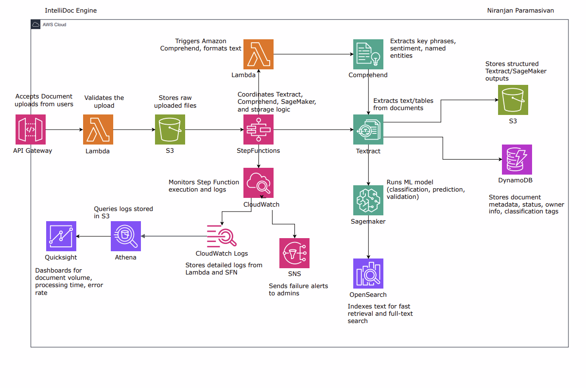

# 📄 IntelliDoc Engine – Intelligent Document Processing on AWS

Welcome to **IntelliDoc Engine**, a scalable, AI-powered document understanding system built entirely on AWS. This project transforms unstructured documents into searchable, structured, and analyzable content using serverless architecture, machine learning, and natural language processing.

---

## 🎯 Project Objective

The IntelliDoc Engine is designed to automate the ingestion, processing, understanding, and retrieval of business documents such as forms, contracts, PDFs, and reports.

**Use Cases:**
- Automating loan or insurance document processing
- Contract intelligence for legal firms
- Healthcare document classification and entity extraction
- Intelligent digital archives

---

## 🧱 Architecture Overview

Here’s how the system works, as visualized in the architecture diagram: 

### 📥 Ingestion

- **API Gateway** accepts document uploads via REST APIs.
- **Lambda** validates and uploads the file to an S3 bucket.

### 📂 Document Storage

- **Amazon S3** stores raw uploaded files and processed results.

### 🧠 Orchestration & Intelligence

- **Step Functions** manages the full workflow.
- **Amazon Textract** extracts text, tables, and forms.
- **Amazon Comprehend** extracts named entities, key phrases, and sentiment.
- **Amazon SageMaker** runs custom ML models for classification or prediction.

### 📑 Metadata & Search

- **Amazon DynamoDB** stores metadata: file status, classification, tags, etc.
- **Amazon OpenSearch** indexes content for semantic and full-text search.

### 📊 Monitoring & Analytics

- **Amazon CloudWatch** monitors and logs Step Functions and Lambda.
- **Amazon SNS** alerts on failures.
- **Amazon Athena** queries logs stored in S3.
- **Amazon QuickSight** visualizes performance metrics and trends.

---

## 🔁 End-to-End Workflow

### 1. Upload & Trigger

- Users upload a document through an API.
- Lambda function validates it and stores it in S3.
- S3 triggers Step Functions via an event.

### 2. Orchestration

- Step Functions launches:
  - **Textract** for OCR
  - **Comprehend** for NLP
  - **SageMaker** for custom ML analysis

### 3. Storage & Indexing

- Structured output saved to **S3**
- Metadata logged in **DynamoDB**
- Text indexed in **OpenSearch**

### 4. Monitoring

- Logs sent to **CloudWatch Logs**
- **SNS** alerts on errors or timeouts

### 5. Analytics

- Logs in S3 queried by **Athena**
- Dashboards created in **QuickSight**

---

## 📚 Components Breakdown

| Component | Description |
|----------|-------------|
| **Amazon API Gateway** | Accepts document upload requests |
| **AWS Lambda** | Validates input, triggers workflow |
| **Amazon S3** | Stores raw and structured files |
| **AWS Step Functions** | Manages processing stages |
| **Amazon Textract** | Extracts text/tables from documents |
| **Amazon Comprehend** | Extracts entities, key phrases, sentiment |
| **Amazon SageMaker** | Custom document ML model (e.g., classification) |
| **Amazon DynamoDB** | Metadata database |
| **Amazon OpenSearch** | Full-text search engine |
| **Amazon CloudWatch** | Logs and metrics for Step Functions & Lambda |
| **Amazon SNS** | Sends alerts on failures |
| **Amazon Athena** | Queries structured logs from S3 |
| **Amazon QuickSight** | BI dashboard for analytics |

---

## 🛡️ Security & Best Practices

- IAM roles scoped to least privilege
- S3 encryption using KMS
- CloudTrail logging for audits
- Optional: VPC Endpoints for private SageMaker/OpenSearch calls

---

## 📊 Sample QuickSight Dashboards

- Document upload success rate
- Average processing time
- Document type distribution
- Failed jobs by component
- ML classification confidence

---

## 🧪 Testing & Validation

- ✅ Upload test files via Postman or frontend app
- ✅ Inspect extracted data in S3 & DynamoDB
- ✅ Run queries in Athena on log data
- ✅ View dashboards in QuickSight

---
<!--
## 📁 Repo Structure

```
/intellidoc-engine/
├── lambda/
│   └── upload_handler.py
├── sagemaker/
│   └── document_classifier.ipynb
├── stepfunctions/
│   └── orchestrator_definition.json
├── assets/
│   └── intellidoc-architecture.png
├── README.md
```
-->

---

## 🤝 Contributions

Feel free to fork and expand! This engine can be extended with features like PDF redaction, classification feedback loop, or even multilingual translation.

---

© 2025 – Niranjan Paramasivan | IntelliDoc Engine
